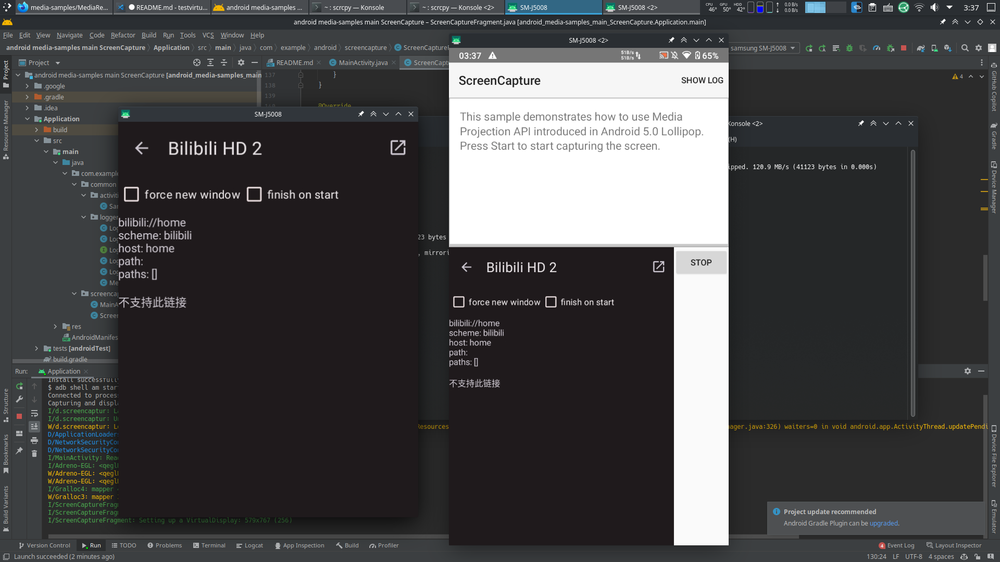

# test virtual display


VirtualDisplay 配合 scrcpy 简单实现多窗口镜像

## 起因

先是在B站看到了[这个视频](https://www.bilibili.com/video/BV1V34y1k71y)

其中实现的"同时使用多个应用"引起了我的注意

然而我主力 ArchLinux up 又没写 Linux 端还没开源

无奈只能想办法自己动手解决

但难点在于如何让应用跑在别的屏幕上

经过一番~~艰难的~~搜索后 找到了

https://source.android.com/devices/tech/display/multi_display

https://github.com/android/media-samples/tree/main/ScreenCapture

经过简单的修改`ScreenCaptureFragment.java`

```diff
182c182
<                 DisplayManager.VIRTUAL_DISPLAY_FLAG_AUTO_MIRROR,
---
>                 DisplayManager.VIRTUAL_DISPLAY_FLAG_PUBLIC,
```

实现了



## 原理

1.应用[通过`MediaProjection`创建`VirtualDisplay`](https://developer.android.com/reference/android/media/projection/MediaProjection#createVirtualDisplay(java.lang.String,%20int,%20int,%20int,%20int,%20android.view.Surface,%20android.hardware.display.VirtualDisplay.Callback,%20android.os.Handler))记录`displayID`

```kotlin
mediaProjection.createVirtualDisplay(
            name, width, height, DisplayMetrics.DENSITY_DEFAULT,
            DisplayManager.VIRTUAL_DISPLAY_FLAG_PUBLIC,
            surface, null, null)
```

2.`adb`使应用在虚拟显示屏上启动
```shell
adb shell am start-activity --display $displayID $intent
```

3.`scrcpy`镜像虚拟屏幕
```shell
scrcpy --display $displayID
```

## 效果

<video src="https://github.com/duzhaokun123/test-virtual-display/blob/main/media/2022-03-18_04-06-48.mkv?raw=true" controls="controls">
media/22022-03-18_04-06-48.mkv
</video>

## 已知问题

-  `29+`会限制`VirtualDisplay`的创建 要求必须使用前台服务 这里使用`28`只是图方便
- 没有输入法 其实会出现在主屏幕上
- 没有系统装饰(返回, 主页 ...) 或许需要系统应用才能创建
- 没有声音 `scrcpy`的责任